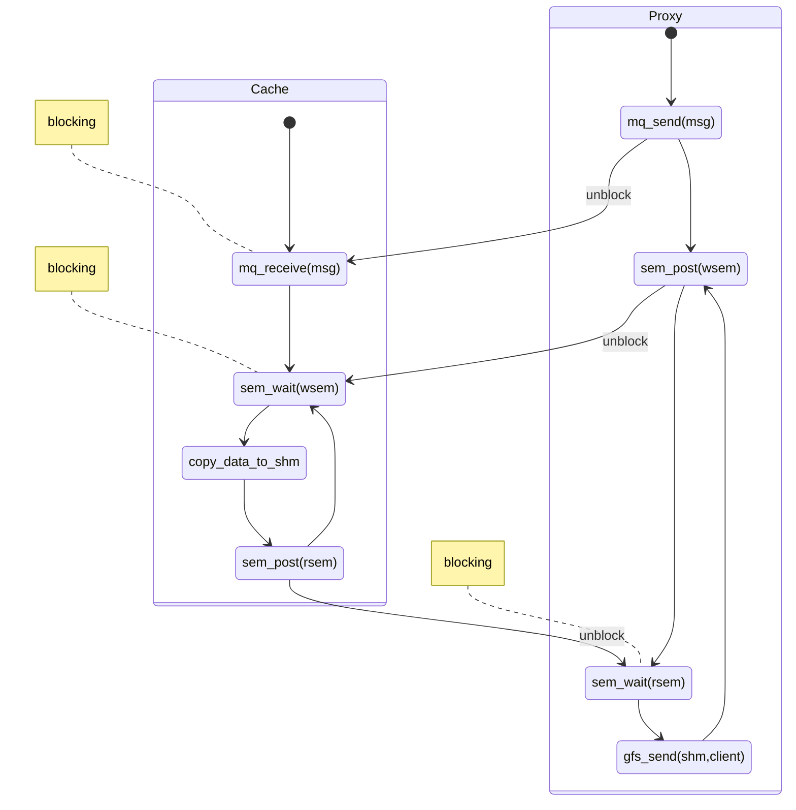
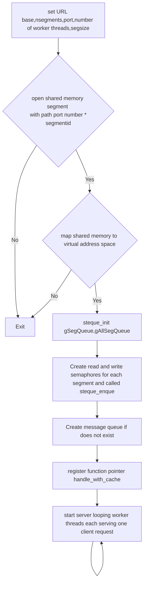
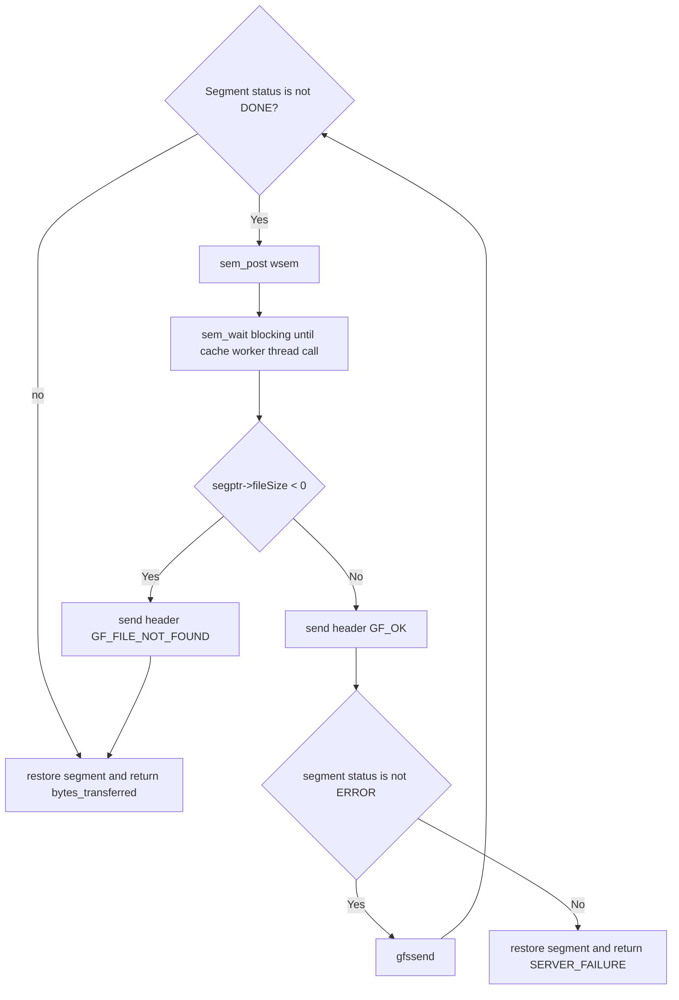
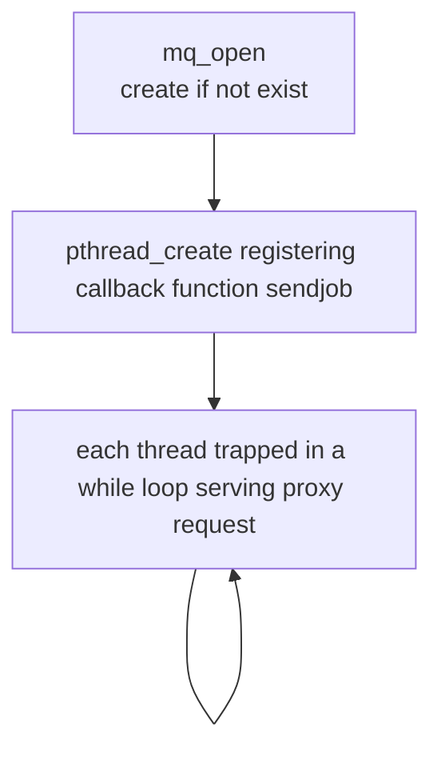
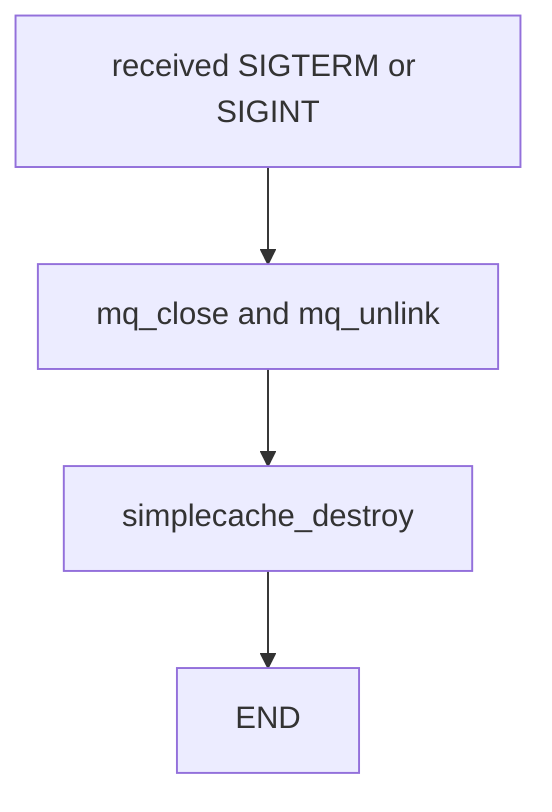
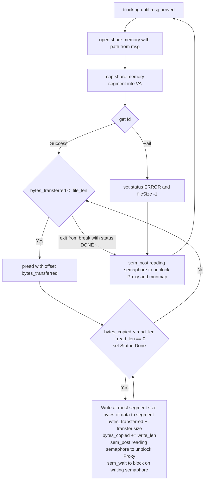

# Project 3 gios-spr-23-pr3

This is **HO NGOK CHAO**'s Readme file.


## Project Description

This project has two parts. 

**Part 1** is basically an extension of [project 1](https://hackmd.io/KsB88XFNSd2idCGiZM7Qrw?view) except this time instead of transferring a file available locally, the **gfserver** is repurposed as **webproxy** and with callback function [libcurl](https://curl.se/libcurl/) registered so it is expected that the file would be downloaded from network upon the request from **gfclient**.


credit: https://github.gatech.edu/gios-spr-23/pr3

**Part 2** is about IPC communication, where instead of using libcurl to download from network, the requirement is now to build a **Cache** process (simplecached) which would read and then deliver content of local file to **Proxy** process. The delivery mechanism involves two channels: **data channel** implemented using [POSIX Message Queue](https://man7.org/linux/man-pages/man7/mq_overview.7.html) and **command channel** using [POSIX shared memory API](https://man7.org/linux/man-pages/man7/shm_overview.7.html)


credit: https://github.gatech.edu/gios-spr-23/pr3


In part 2, no download from external network happened for simplicity; hence when proxy request some URL which Cache doesn't have locally (cached), we simply return *GF_FILE_NOT_FOUND* to **Client**.

## Project Design
### part 1

Two seperate curl sessions (curl_easy_perform) happened.

One for [HTTP HEAD request](https://reqbin.com/Article/HttpHead) so that we only obtained the **Content-Length** from header via **CURLINFO_CONTENT_LENGTH_DOWNLOAD_T** and **CURLOPT_NOBODY** so that we don't need to read everything into memory to calculate the file size to send the header to Client.

And then the other curl can use **CURLOPT_WRITEFUNCTION** and **CURLOPT_WRITEDATA** to send each chunk of data received from external network (via http) to Client.

Trade-offs explained:
- Content-Length may not be accurate if the content to be downloaded is actually generated dynamically. But sending to client whenever we receive a chunk is faster then reading everything and send to client and also more memory parsimonious.

- Two curl sessions is slower than one curl which write header and body data seperatedly to two different memory location via **CURLOPT_WRITEDATA** and **CURLOPT_HEADERDATA** like in this example https://curl.se/libcurl/c/CURLOPT_WRITEFUNCTION.html but then we need to efficently parse for Content-Length and for simplicity I didn't choose this method.


### part 2

In order to fulfill the requirement of communication between **Proxy** and **Cache** where Proxy send a request to Cache and Cache feedback Proxy the data requested, we need two channels, command channel for sending request and data channel for content sharing.

The following diagram explained the general flow of information between **one** proxy worker thread (**serving one client request**) and **one** cache worker thread (**serving one proxy request**) 

```sequence

Proxy->Cache: Please write /paraglider.jpg to segment /gios-spr-23-pr3-25496
Note left of Proxy: Unlock writing semaphore \n and block on reading semaphore
Note right of Cache: Read local file,\n write to segment
Cache-->Proxy: unblock reading semaphore
Note right of Cache: Block on writing semaphore
Note left of Proxy: Read content from segment
Proxy->Cache: another request
```


- **command channel** implemented using [POSIX Message Queue](https://man7.org/linux/man-pages/man7/mq_overview.7.html)
- **data channel** using [POSIX shared memory API](https://man7.org/linux/man-pages/man7/shm_overview.7.html)

While it is possible to use shared memory for everything for these two **unrelated processes** (one is not the parent of the other). It is easier and less error-prone to use OS provided facility to send request with small data.

But for content sharing where the data size is considerably larger it is better to use shared memory for performance reason. 

Trade-offs for [POSIX Message Queue](https://man7.org/linux/man-pages/man7/mq_overview.7.html):
- slower than shared memory, but kernel takes caring of synchronization
- while command channel is one way (proxy to cache) so we can use **FIFO** as well, but we would need to open N (given N pair of proxy and cache thread) **FIFO** if we don't want to be limited by **PIPE_BUF** and read exactly predefined message size of data each time from the FIFO. This is because if we choose to have only one FIFO and if message is larger than **PIPE_BUF** the message send by one proxy thread would mix with another, and there is no concept of cutoff builtin other than the developer who know the predefined message size.
- In my opinion **POSIX Message Queue** has better flexibility and cleaner where message size can be set by **msgsize_max** (which has hard limit as well **HARD_MSGSIZEMAX** depending on the platform) and there is explicit invalid argument error for message queue; and the OS takes care of everything for you including poping exactly one message and synchronization. 
-  Although for performance concern (need to copy from user to kernal and then to user space), minimum information is put into the command channel and in this implementation only the segment name and segment size is put there (details in implementation section) so **PIPE_BUF** could have been enough.

Trade-offs for [POSIX shared memory](https://man7.org/linux/man-pages/man7/shm_overview.7.html)

- POSIX shared memory is less widely available (especially on older systems) than System V shared memory. But the interface is easier to use (directly using a path as key without the need to call to another function) and a file descriptor is returned.
- Faster without the back and forth between user space and kernel space, but then we need to take of synchronization, in my implementation, I used one reading semaphore and one writing semaphore. They are used in the manner of the follow simplified diagram (a more detailed one in control graphs where data need to be read/send chunk by chunk).





 

## Flow of Control Graphs

### part 1

Webproxy's control graphs is really the same as Project one except the callback function is changed to curl which can be found here https://hackmd.io/KsB88XFNSd2idCGiZM7Qrw?view

### part 2
**Proxy** has to established **Message Queue** for shared memory path, **Shared Memory segments** for the content plus auxiliary info, **Linked List** for for boss thread to enqueue shared memory and worker threads when one of them picked up one client request, it would pop one available segment from the Linked List and share its name via Message Queue with Cache, and the data sharing would continue as can been seen in the graph below. When the worker thread done serving the client request, it would restore and enqueue the segment back to the Linked List. The Linked List is protected by **Mutex** and **Condition Variable**.

To allow unique path name for multiple Proxy server, /gios=spr-23-pr3-{port * segmentid} is used as pathname, since each Proxy server would use different port.

*webproxy.c*


<div style="page-break-after: always;"></div>

Details of send and receive while loop communicating between Cache and Client



<div style="page-break-after: always;"></div>

```flow

sig=>operation: received SIGTERM or SIGINT
loop=>operation: - pop all segment of gAllSegQueue
- release all segment(including its semaphore) inside
dqueue=>operation: steque_destory(gAllSegQueue)
steque_destroy(gSegQueue)
dmsg=>operation: mq_close and mq_unlink
end=>operation: exit

sig->loop->dqueue->dmsg->end
```

**Cache** has to established **Message Queue** for shared memory path if it is not already created by **Proxy**, and then the main thread would spawn worker pthreads each thread would serve one request from proxy until status done; the worker thread would be trapped in a while loop and is blocked by **msg_wait()** until proxy called **msg_send()** with the **path of Shared Memory segments**, which the worker thread would open and map the share memory segment to the current **virtual address space** for writing the content it read by request and call **sem_post(rsem)** to unblock Proxy worker trhead which is blocked on **rsem** (reading semaphore).

In simplecached.c



<div style="page-break-after: always;"></div>

sig_handler for simplecached.c


<div style="page-break-after: always;"></div>

While loop 



## Implementation
The Project Design and Flow of Control Graphs section already explained in details why certain IPCs are chosen and the control flow for using them.

This section illustrate some **structs** and **enum** which controled what and how it is shared.

For each request there is three status possible,

- **START** for the proxy request not yet be served
- **ERROR** for the proxy request cannot be served because of various reading error or **file not found error**(distinguish from other error by fileSize == -1)
- **DONE** proxy request completed, all content in the share memory segment
```c
typedef enum transfer_status {START,ERROR,DONE} transfer_status;
```


Details are written in the comment for **seg_info**, this is the variable type for Node of Linked List.
Note that the data member of this struct has flexible size which is supported since C99; later we assign in total **sizeof(seg_info)+segsize** memory to the whole struct object where segsize bytes of share memory is allocated for this data member.

```c
typedef struct seg_info{
  char name[100]; //segment name on shm_open
  char filePath[1024]; // request file path
  int segsize; //segment size specified by user
  int tranSize; // number of bytes written to data segment
  int fileSize; // -1 if file not found otherwise file size in bytes
  int header;
  sem_t rsem; // inter process read semaphore for the cache to tell proxy ready to read
  sem_t wsem; // inter process write semaphore for the proxy to tell cache ready to write
  transfer_status status;
  char data[];// flexible array member

} seg_info;
```

Each request from Proxy to Cache is start by msg_send which send a message of this type **message_info**; minimum information is contained here for faster message delivery and leave other information to **seg_info** above since shared memory is more efficient for large data transfer.
```c
typedef struct message_info{
  char name[30]; // shared memory path
  int segsize;
} message_info;
```

Some global variables on BSS segments shared among boss and worker threads.

- **gSegQueue** for multiple Proxy worker thread to obtain and release segment (one at a time protected by mutex and condition variavle).

- **gAllSegQueue** is a Queue with all shared memory segments so that signal handler can free all segments at all time immediately.

- **gRequestQueue** is the message queue shared by all Proxy threads.
```c=
steque_t *gSegQueue, *gAllSegQueue;
mqd_t gRequestQueue;
```

## Testing
Tested using base,stress,soak test in `ipcstress.py` from https://github.gatech.edu/cparaz3/6200-tools

>python3 ./ipcstress.py /path/to/project/cache test-name
Current tests:
base - the baseline test, get this to work first
stress - stress with an increasing number of threads but fixed parameters
soak - run for a long time with a fixed number of threads

In each test, subprocesses are opened for Proxy and Cache via popen() and utime and stime data is retrieved from  **/proc/{pid}/stat**'s 13 and 14 column (counting from 0).
```python
def read_cpu_times(pid: int) -> Tuple[int, int]:
    """ Read utime (user time) and stime (system/kernel time) for a PID, in ticks. """
    with open(f'/proc/{pid}/stat', 'r') as file:
        entries = file.readline().rstrip().split(' ')
        return int(entries[13]), int(entries[14])
```

Two displays for the scripts:

parameters input:

>cache_thread_count=100, proxy_thread_count=100, proxy_segment_count=50, proxy_segment_size=1048576, download_thread_count=100, request_count=1000000

performance output:

>8000/1000000 in 1.00s, 998.76 rps, 3070636950 bps,
>cache: 0.25s 24.97% user, 0.47s 46.94% kernel, 0.72s 71.91% total,
>proxy: 0.06s 5.99% user, 0.47s 46.94% kernel, 0.53s 52.93% total
Subprocess download client still running:

>9000/1000000 in 1.00s, 999.09 rps, 3071660223 bps,
> cache: 0.27s 26.98% user, 0.47s 46.96% kernel, 0.74s 73.93% total
> proxy: 0.09s 8.99% user, 0.44s 43.96% kernel, 0.53s 52.95% total

which means serving  1000 requests in one second, 999.09 requestes served per second, 3071660223 bytes per second transferred

for cache subprocess 0.27 seconds on user mode, 0.47 seconds on kernel mode, hence CPU usage (the core it is running on ) 73.93%

for proxy subprocess 0.09 seconds on user mode, 0.44 seconds on kernel mode, hence CPU usage 52.95%

On proxy, the heavily use of kernel seems to spent on  copy_user_enhanced_fast_string and clear_page_erms hence I suspect it is clearing socket memory or copy from shared memory to it make these cost. Suppose we could open a file descriptor for the requested file directly and directly send to socket fd via **sendfile()** without copying from kernel, then our process could be faster.

from https://man7.org/linux/man-pages/man2/sendfile.2.html


> sendfile() copies data between one file descriptor and another.

```c
ssize_t sendfile(int out_fd, int in_fd, off_t *offset, size_t count);
```


Using  sudo perf top -p

```bash
Samples: 5M of event 'cycles', 4000 Hz, Event count (approx.): 39 lost: 0/0 drop: 0/0
Overhead  Shared O  Symbol
  53.85%  [kernel]  [k] clear_page_erms
  43.59%  [kernel]  [k] copy_user_enhanced_fast_string
   2.56%  webproxy  [.] __sanitizer::mem_is_zero
```


On cache, the kernel time is spent on copy_user_enhanced_fast_string only, I think this is because I used pread which would copy from the kernal space memory to user space memory, and then memcpy to shared memory data member, but I could also use **splice()** which should be faster since it avoid the copying from kernel to user.

from https://manned.org/splice.2
> splice() moves data between two file descriptors without copying between
kernel address space and user address space.

```bash
Samples: 45K of event 'cycles', 4000 Hz, Event count (approx.): 12288907981 lost: 0/0 drop: 0/0
Overhead  Shared Object       Symbol
  35.56%  [kernel]            [k] copy_user_enhanced_fast_string
  19.54%  libc-2.31.so        [.] __opendirat
  10.04%  simplecached        [.] __sanitizer::mem_is_zero
   4.52%  [kernel]            [k] filemap_get_read_batch
   2.47%  [kernel]            [k] filemap_read
   1.63%  [kernel]            [k] copy_page_to_iter
   1.54%  [kernel]            [k] psi_group_change
   0.69%  [kernel]            [k] gup_pgd_range
   0.63%  [kernel]            [k] mark_page_accessed
```

   


## References:
flexible array member:
https://gcc.gnu.org/onlinedocs/gcc/Zero-Length.html

POSIX semaphore:
https://linux.die.net/man/3/sem_init

mmap:
https://man7.org/linux/man-pages/man2/mmap.2.html

POSIX message queues: 
https://man7.org/linux/man-pages/man3/mq_open.3.html
https://w3.cs.jmu.edu/kirkpams/OpenCSF/Books/csf/html/MQueues.html#cl3-7
https://man7.org/linux/man-pages/man3/mq_receive.3.html

FAM:
https://gcc.gnu.org/onlinedocs/gcc/Zero-Length.html

Read with offset:
https://man7.org/linux/man-pages/man2/pread.2.html

Page 74 for read/write semaphores design:
https://man7.org/conf/lca2013/IPC_Overview-LCA-2013-printable.pdf

libcurl for part 1:
https://curl.se/libcurl/c/CURLINFO_CONTENT_LENGTH_DOWNLOAD_T.html
https://curl.se/libcurl/c/CURLOPT_NOBODY.html
https://curl.se/libcurl/c/CURLOPT_WRITEFUNCTION.html

Test tools:
https://github.gatech.edu/cparaz3/6200-tools

Perf:
https://sasha-f.medium.com/why-mmap-is-faster-than-system-calls-24718e75ab37
https://hackmd.io/@sysprog/gnu-linux-dev/https%3A%2F%2Fhackmd.io%2Fs%2FB11109rdg

splice: 
https://manned.org/splice.2
https://stackoverflow.com/questions/61514215/where-and-why-do-read2-and-write2-system-calls-copy-to-and-from-

sendfile:
https://man7.org/linux/man-pages/man2/sendfile.2.html
